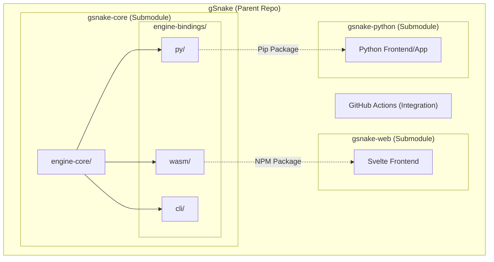

# Core Flows: Modular Repository Restructuring

## Architecture Visualization


## Folder structure
```
gSnake/                         # Parent repository
├── .github/
│   └── workflows/              # GitHub Actions (integration CI)
│
├── gsnake-core/                # Submodule
│   ├── engine-core/
│   │   └── ...                 # Core engine logic
│   │
│   └── engine-bindings/
│       ├── wasm/
│       │   └── ...             # WASM bindings (published as NPM package)
│       │
│       ├── py/
│       │   └── ...             # Python bindings (published as pip package)
│       │
│       └── cli/
│           └── ...             # CLI bindings
│
├── gsnake-web/                 # Submodule
│   ├── src/
│   │   └── ...                 # Svelte frontend
│   ├── package.json
│   └── ...
│
├── gsnake-python/              # Submodule
│   ├── pyproject.toml
│   └── ...
│
└── README.md
```

## Flow 1: Core Engine or Level Update
**Description:** A developer updates the game logic or adds a new level that should be available across all platforms.
**Trigger:** Change in `engine-core/` or `data/levels.json` within the `gsnake-core` submodule.
**Steps:**
1. Developer modifies core Rust logic or level data.
2. Developer runs `gsnake-core` native tests (Cargo).
3. Developer builds bindings for target platforms (WASM, Python, or CLI).
4. Developer verifies changes using the internal CLI tool.
5. Developer commits changes to the `gsnake-core` repository.

## Flow 2: Web Frontend Consumption
**Description:** The Web frontend adopts the latest engine features or level updates.
**Trigger:** New version of `gsnake-wasm` is available.
**Steps:**
1. Developer runs `npm link ../gsnake-core/engine-bindings/wasm/pkg` (or similar) to use the local build.
2. Web developer ensures `package.json` reflects the local link or the correct SemVer.
3. Developer runs `npm install` if necessary.
4. Developer runs the Svelte dev server to verify integration.
5. UI-specific changes are committed to the `gsnake-web` repository.

## Flow 3: Python Frontend Consumption
**Description:** The Python application adopts the latest engine features.
**Trigger:** New version of `gsnake-py` is available.
**Steps:**
1. Python developer runs `pip install -e ../gsnake-core/engine-bindings/py` to link the local development version.
2. Developer updates the requirement in `requirements.txt` or `pyproject.toml` to the next SemVer target.
3. Developer runs the Python application/tests to verify integration.
4. Python-specific changes are committed to the `gsnake-python` repository.

## Flow 4: Integration Specification (Parent Repo)
**Description:** Defining a new feature that spans multiple modules.
**Trigger:** Product requirement for a new Epic.
**Steps:**
1. Maintainer creates/updates an Epic in `epics/` in the parent repository.
2. Maintainer updates submodule pointers in the parent repository once individual modules are ready.
3. Global CI runs existing Playwright tests to ensure the engine and web client integration is stable.
