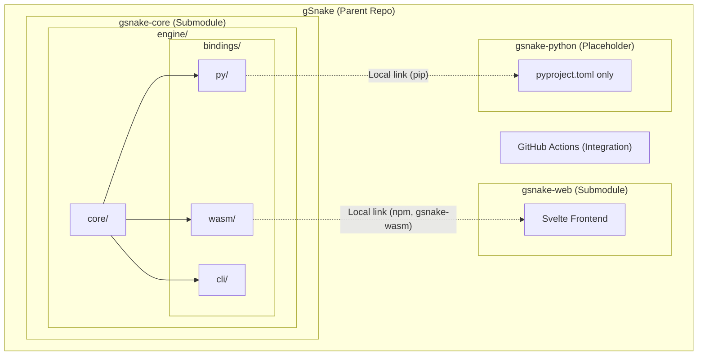
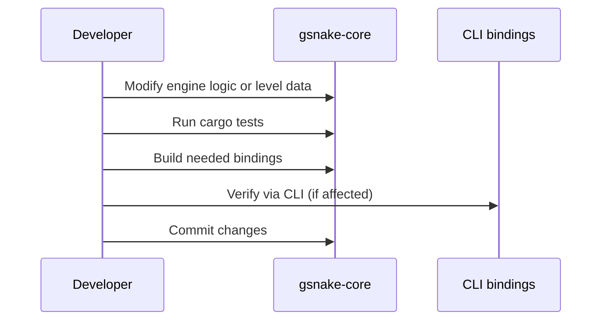
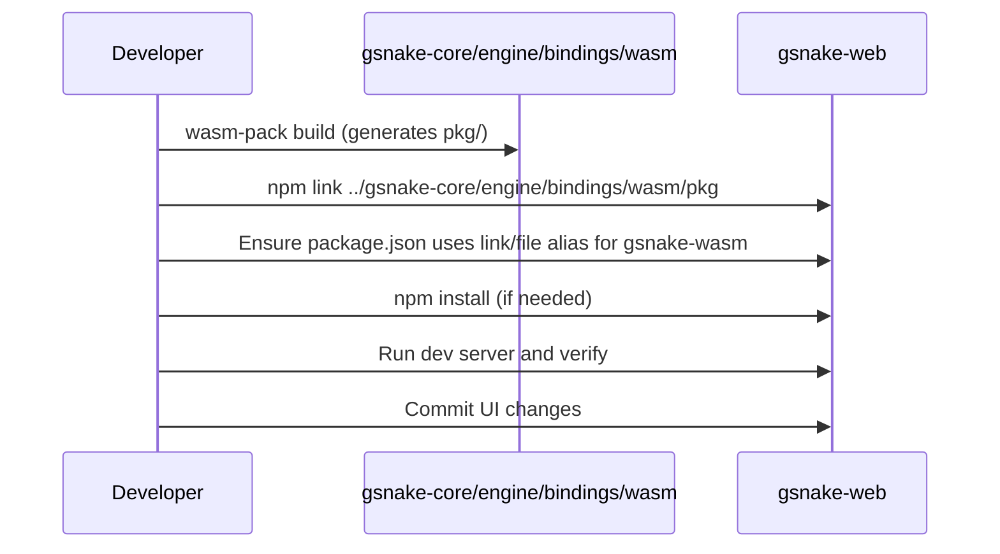
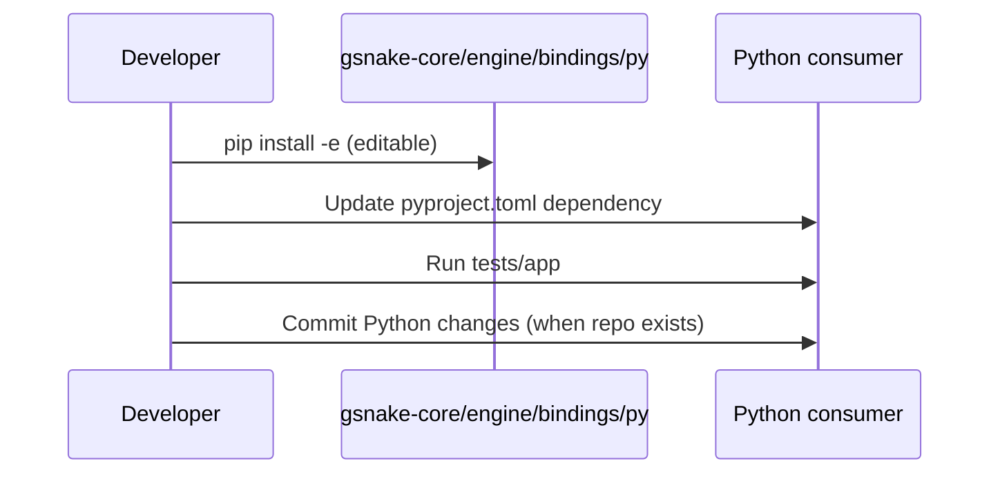
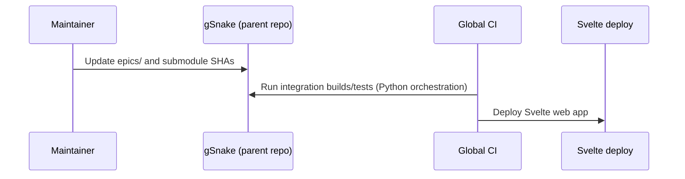

# Core Flows: Modular Repository Restructuring

## Architecture Visualization


## Folder structure
```
gSnake/                         # Parent repository
├── .github/
│   └── workflows/              # GitHub Actions (integration CI)
│
├── gsnake-core/                # Submodule
│   └── engine/
│       ├── core/
│       │   └── ...             # Core engine logic
│       │
│       └── bindings/
│           ├── wasm/
│           │   └── ...         # WASM bindings (local npm link)
│           │
│           ├── py/
│           │   └── ...         # Python bindings (pyproject.toml)
│           │
│           └── cli/
│               └── ...         # CLI bindings
│
├── gsnake-web/                 # Submodule
│   ├── src/
│   │   └── ...                 # Svelte frontend
│   ├── package.json
│   └── ...
│
├── gsnake-python/              # Placeholder only (no implementation yet)
│   ├── pyproject.toml
│   └── ...
│
└── README.md
```

## Flow 1: Core Engine or Level Update
**Description:** A developer updates the game logic or adds a new level that should be available across all platforms.
**Trigger:** Change in `engine/core/` or `engine/core/data/levels.json` within the `gsnake-core` submodule.

**Steps:**
1. Developer modifies core Rust logic or level data.
2. Developer runs `gsnake-core` native tests (Cargo).
3. Developer builds bindings for target platforms as needed (WASM via `wasm-pack build`, Python via local editable install, CLI via Cargo).
4. Developer verifies changes using the internal CLI tool (when CLI is affected).
5. Developer commits changes to the `gsnake-core` repository.

## Flow 2: Web Frontend Consumption
**Description:** The Web frontend adopts the latest engine features or level updates.
**Trigger:** Local WASM build is needed for development or a new WASM version is available.

**Steps:**
1. Developer runs `wasm-pack build` in `gsnake-core/engine/bindings/wasm` (generates `pkg/`).
2. Developer runs `npm link ../gsnake-core/engine/bindings/wasm/pkg` to use the local build.
3. Web developer ensures `package.json` uses the local link/file alias for `gsnake-wasm`.
4. Developer runs `npm install` if necessary.
5. Developer runs the Svelte dev server to verify integration.
6. UI-specific changes are committed to the `gsnake-web` repository.

## Flow 3: Python Frontend Consumption
**Description:** A Python consumer adopts the latest engine features.
**Trigger:** Local Python bindings install is needed for development or a new Python version is available.

**Steps:**
1. Python developer runs `pip install -e ../gsnake-core/engine/bindings/py` to link the local development version.
2. Developer updates the requirement in `pyproject.toml` to the next SemVer target.
3. Developer runs the Python application/tests to verify integration.
4. Python-specific changes are committed to the appropriate Python repository when it exists.

## Flow 4: Integration Specification (Parent Repo)
**Description:** Defining a new feature that spans multiple modules.
**Trigger:** Product requirement for a new Epic.

**Steps:**
1. Maintainer creates/updates an Epic in `epics/` in the parent repository.
2. Maintainer updates submodule pointers in the parent repository once individual modules are ready.
3. Global CI runs integration builds/tests (including Playwright) using Python orchestration and deploys the Svelte web app.

## Best-Practice Suggestions (Flows)

-   **Flow 1:** Keep a single `gsnake-core` script or Make target to run tests and build bindings so the steps stay consistent.
-   **Flow 2:** Ignore `pkg/` in Git and document `npm unlink` cleanup steps for local development.
-   **Flow 3:** Standardize on `pyproject.toml` and keep editable installs as the local dev default.
-   **Flow 4:** Pin toolchain versions in CI and use submodule SHAs for reproducible integration runs.

**Recommendation:** Add a small set of shared Python scripts in the parent repo to orchestrate the dev flows (build core, build wasm, link deps, run Playwright) so local and CI runs mirror each other.
