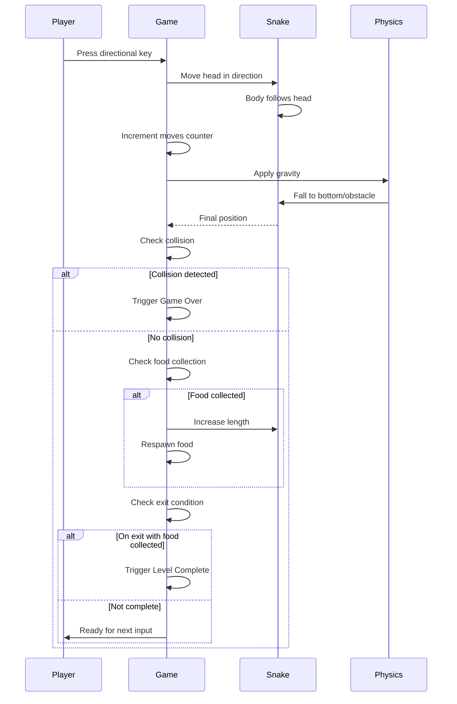

## Overview

This document defines the user flows for Gravity Snake, a turn-based puzzle game where players navigate a snake through levels using directional movement and gravity mechanics. The game emphasizes strategic planning over reflexes.

## UI Layout

```wireframe
<!DOCTYPE html>
<html>
<head>
<style>
* {
  margin: 0;
  padding: 0;
  box-sizing: border-box;
}
body {
  font-family: Arial, sans-serif;
  background: #f5f5f5;
  padding: 20px;
  display: flex;
  justify-content: center;
  align-items: center;
  min-height: 100vh;
}
.game-container {
  background: white;
  padding: 20px;
  border-radius: 8px;
  box-shadow: 0 2px 8px rgba(0,0,0,0.1);
  max-width: 600px;
  width: 100%;
}
.header {
  display: flex;
  justify-content: space-between;
  align-items: center;
  margin-bottom: 20px;
  padding-bottom: 15px;
  border-bottom: 2px solid #e0e0e0;
}
.score-info {
  display: flex;
  gap: 20px;
  font-size: 14px;
}
.score-item {
  display: flex;
  flex-direction: column;
}
.score-label {
  color: #666;
  font-size: 11px;
  text-transform: uppercase;
  margin-bottom: 2px;
}
.score-value {
  font-weight: bold;
  font-size: 18px;
  color: #333;
}
.restart-btn {
  padding: 8px 16px;
  background: #4CAF50;
  color: white;
  border: none;
  border-radius: 4px;
  cursor: pointer;
  font-size: 14px;
}
.game-field {
  width: 100%;
  aspect-ratio: 1;
  background: #fafafa;
  border: 2px solid #ddd;
  display: grid;
  grid-template-columns: repeat(15, 1fr);
  grid-template-rows: repeat(15, 1fr);
  gap: 1px;
  background: #ddd;
}
.cell {
  background: white;
}
.cell.snake-head {
  background: #2196F3;
}
.cell.snake-body {
  background: #64B5F6;
}
.cell.food {
  background: #FF5722;
}
.cell.obstacle {
  background: #424242;
}
.cell.exit {
  background: #4CAF50;
}
.overlay {
  position: fixed;
  top: 0;
  left: 0;
  right: 0;
  bottom: 0;
  background: rgba(0,0,0,0.7);
  display: none;
  justify-content: center;
  align-items: center;
}
.overlay.active {
  display: flex;
}
.modal {
  background: white;
  padding: 30px;
  border-radius: 8px;
  text-align: center;
  min-width: 300px;
}
.modal h2 {
  margin-bottom: 20px;
  color: #333;
}
.modal-buttons {
  display: flex;
  gap: 10px;
  justify-content: center;
}
.modal-btn {
  padding: 10px 20px;
  border: none;
  border-radius: 4px;
  cursor: pointer;
  font-size: 14px;
}
.modal-btn.primary {
  background: #4CAF50;
  color: white;
}
.modal-btn.secondary {
  background: #e0e0e0;
  color: #333;
}
</style>
</head>
<body>
<div class="game-container">
  <div class="header">
    <div class="score-info">
      <div class="score-item">
        <span class="score-label">Level</span>
        <span class="score-value" data-element-id="level-display">1</span>
      </div>
      <div class="score-item">
        <span class="score-label">Length</span>
        <span class="score-value" data-element-id="length-display">3</span>
      </div>
      <div class="score-item">
        <span class="score-label">Moves</span>
        <span class="score-value" data-element-id="moves-display">0</span>
      </div>
    </div>
    <button class="restart-btn" data-element-id="restart-button">Restart</button>
  </div>
  
  <div class="game-field" data-element-id="game-field">
    <!-- 15x15 grid cells -->
    <div class="cell"></div>
    <div class="cell"></div>
    <div class="cell"></div>
    <div class="cell snake-head"></div>
    <div class="cell"></div>
    <div class="cell"></div>
    <div class="cell"></div>
    <div class="cell"></div>
    <div class="cell"></div>
    <div class="cell"></div>
    <div class="cell"></div>
    <div class="cell"></div>
    <div class="cell"></div>
    <div class="cell"></div>
    <div class="cell"></div>
    <!-- More cells... (showing sample layout) -->
    <div class="cell"></div>
    <div class="cell"></div>
    <div class="cell snake-body"></div>
    <div class="cell snake-body"></div>
    <div class="cell"></div>
    <div class="cell"></div>
    <div class="cell"></div>
    <div class="cell"></div>
    <div class="cell food"></div>
    <div class="cell"></div>
    <div class="cell"></div>
    <div class="cell"></div>
    <div class="cell"></div>
    <div class="cell"></div>
    <div class="cell"></div>
    <!-- Additional rows with obstacles and exit -->
    <div class="cell"></div>
    <div class="cell"></div>
    <div class="cell"></div>
    <div class="cell"></div>
    <div class="cell obstacle"></div>
    <div class="cell obstacle"></div>
    <div class="cell obstacle"></div>
    <div class="cell"></div>
    <div class="cell"></div>
    <div class="cell"></div>
    <div class="cell"></div>
    <div class="cell"></div>
    <div class="cell"></div>
    <div class="cell exit"></div>
    <div class="cell"></div>
  </div>
</div>

<!-- Game Over Overlay -->
<div class="overlay" data-element-id="game-over-overlay">
  <div class="modal">
    <h2>Game Over</h2>
    <div class="modal-buttons">
      <button class="modal-btn primary" data-element-id="restart-level-btn">Restart Level</button>
      <button class="modal-btn secondary" data-element-id="back-to-level1-btn">Back to Level 1</button>
    </div>
  </div>
</div>

<!-- Game Complete Overlay -->
<div class="overlay" data-element-id="game-complete-overlay">
  <div class="modal">
    <h2>All Levels Complete!</h2>
    <p style="margin: 15px 0; color: #666;">Congratulations! You've beaten all levels.</p>
    <p style="font-size: 12px; color: #999;">Refresh the page to play again.</p>
  </div>
</div>
</body>
</html>
```

---

## Flow 1: Game Initialization

**Description:** The player loads the game and begins playing.

**Trigger:** Page load

**Steps:**

1. Game loads and immediately displays Level 1
2. Game field shows:
  - Snake at starting position (3 segments)
  - Food item(s) placed in level
  - Static obstacles/platforms
  - Exit/goal tile
3. Score display shows: Level 1, Length 3, Moves 0
4. Restart button is visible and active
5. Game is ready for player input (keyboard listening active)

**Exit:** Player is in active gameplay state, ready to make first move

---

## Flow 2: Core Gameplay Loop

**Description:** The moment-to-moment interaction where the player makes moves, gravity applies, and game state updates.

**Trigger:** Player presses arrow key or WASD key

**Steps:**

1. Player presses directional key (North/South/East/West)
2. Snake head moves one tile in the pressed direction
3. Snake body follows (each segment moves to previous segment's position)
4. Moves counter increments by 1
5. Gravity applies instantly:
  - Snake falls downward until head hits obstacle, floor, or snake body
  - Snake appears at final position (no animation)
6. Game checks collision:
  - If snake head hits obstacle or own body → Go to Flow 4 (Game Over)
  - Otherwise, continue
7. Game checks food collection:
  - If snake head is on food tile → Snake length increases by 1, food respawns at new location
  - Length display updates
8. Game checks exit condition:
  - If snake head is on exit tile AND food has been collected → Go to Flow 3 (Level Completion)
  - Otherwise, continue
9. Game returns to waiting for next player input

**Exit:** Game is ready for next player move, or transitions to Level Completion/Game Over



---

## Flow 3: Level Completion & Progression

**Description:** Player successfully completes a level by collecting food and reaching the exit.

**Trigger:** Snake head reaches exit tile after collecting all required food

**Steps:**

1. Level completion is detected
2. Next level loads instantly (no transition message)
3. Game field updates to show new level layout:
  - Snake resets to starting position (3 segments)
  - New obstacle/platform configuration
  - New food placement
  - New exit location
4. Score display updates: Level number increments
5. Moves counter resets to 0
6. Length resets to 3
7. Game is ready for player input

**Special Case - Final Level:**

- If player completes the last level:
  - "All Levels Complete!" overlay appears
  - Message: "Congratulations! You've beaten all levels."
  - Subtext: "Refresh the page to play again."
  - No buttons (game ends)

**Exit:** Player is in active gameplay state on new level, or game has ended (final level)

---

## Flow 4: Game Over & Recovery

**Description:** Player collides with obstacle or own body, triggering game over state.

**Trigger:** Snake head collides with obstacle or snake body segment

**Steps:**

1. Collision is detected
2. "Game Over" overlay appears immediately
3. Overlay displays two buttons:
  - "Restart Level" (primary action)
  - "Back to Level 1" (secondary action)
4. Game waits for player choice:
  - **If "Restart Level":** Current level reloads with reset state (snake at start, moves = 0, length = 3)
  - **If "Back to Level 1":** Level 1 loads with reset state
5. Overlay closes
6. Game is ready for player input

**Exit:** Player is in active gameplay state on chosen level

---

## Flow 5: Manual Restart

**Description:** Player clicks the Restart button during active gameplay.

**Trigger:** Player clicks "Restart" button in header

**Steps:**

1. Current level immediately reloads
2. Game state resets:
  - Snake returns to starting position (3 segments)
  - Moves counter resets to 0
  - Length resets to 3
  - Food and obstacles return to initial positions
3. Game is ready for player input

**Exit:** Player is in active gameplay state on same level with fresh start

---

## Flow 6: Input Blocking During Gravity

**Description:** Ensures player cannot input moves while gravity is resolving.

**Trigger:** Gravity begins applying after a player move

**Steps:**

1. Player makes a move (directional key press)
2. Input handler is disabled
3. Gravity resolves instantly (snake falls to final position)
4. Input handler is re-enabled
5. Game is ready for next player input

**Note:** Since gravity is instant (no animation), this blocking is imperceptible to the player but prevents input queue issues.

---

## Key Interaction Principles

### Information Hierarchy

- **Primary:** Game field (largest visual element, center focus)
- **Secondary:** Score metrics (level, length, moves) - always visible but not intrusive
- **Tertiary:** Restart button - available but not prominent

### State Communication

- **Active Play:** Clean game field, no overlays
- **Game Over:** Modal overlay with clear options
- **Game Complete:** Modal overlay with congratulatory message
- **Level Transition:** Instant (no loading state needed)

### Input Model

- Keyboard-only (arrow keys or WASD)
- Turn-based (one move at a time)
- Input blocked during gravity resolution
- No move queuing or buffering
- **Opposite direction prevention:** Cannot make 180-degree turns (e.g., cannot move South if currently moving North). This prevents accidental self-collision and maintains game flow.

### Visual Feedback

- Snake head: Distinct color from body
- Snake body: Connected segments
- Food: Clearly visible and distinct
- Obstacles: Solid, impassable appearance
- Exit: Visually distinct goal marker
- No animations (instant state changes)

