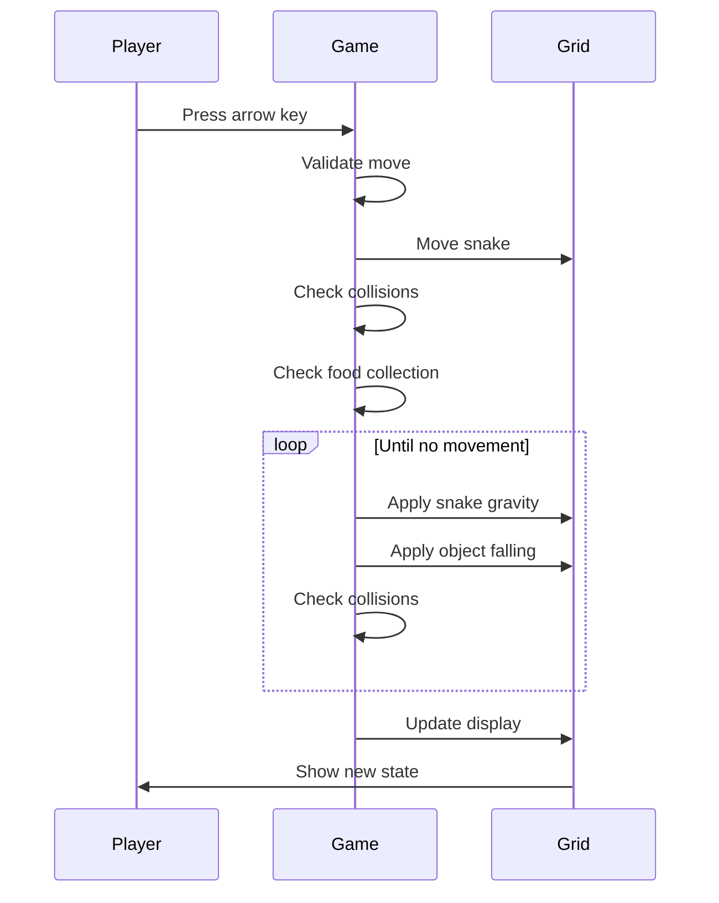

## Overview

This spec defines the gameplay flows and interactions for the extended game object system. Players discover object behaviors through experimentation, with visual feedback provided through distinct colors and animations.

## Visual Design Language


| Object Type       | Color       | Visual Pattern   | Platform Behavior          |
| ----------------- | ----------- | ---------------- | -------------------------- |
| Floating Food     | Orange      | Solid fill       | Acts as platform           |
| Falling Food      | Yellow      | Solid fill       | Platform only when settled |
| Stone             | Brown       | Solid fill       | Acts as platform           |
| Spike             | Red         | Solid fill       | No platform (deadly)       |
| Solid Exit        | Green       | Filled pattern   | Acts as platform           |
| Fall-Through Exit | Light Green | Hole/gap pattern | No platform                |
| Obstacle          | Dark Gray   | Solid fill       | Acts as platform           |
| Regular Food      | Red/Orange  | Solid fill       | Acts as platform           |


## Flow 1: Core Gameplay Loop

**Description:** The fundamental game loop with new object interactions

**Entry Point:** Player presses arrow key to move snake

**Flow:**

1. Player presses arrow key (North/South/East/West)
2. Game validates move (not opposite direction, not blocked push)
3. Snake moves one cell in the chosen direction
4. Game checks if snake ate food (any type):
  - If yes: snake grows, food disappears
  - If no: snake tail shrinks (maintains length)
5. Snake falls due to gravity until hitting solid object
6. All falling objects (stones, falling food) fall until hitting solid objects
7. Game checks collisions:
  - Spike contact → Game Over
  - Obstacle/wall contact → Game Over
  - Self-collision → Game Over
  - Exit reached (with all food collected) → Level Complete
8. Grid updates with new positions
9. Player sees updated game state
10. Loop continues until game over or level complete

**Key Behaviors:**

- Falling happens sequentially: snake first, then all other falling objects
- All falling completes before next player input is accepted
- Visual updates are instant (no smooth animations)



## Flow 2: Collecting Floating Food

**Description:** Player collects floating food that stays in place

**Entry Point:** Snake moves into cell containing floating food

**Flow:**

1. Snake head enters cell with floating food (orange)
2. Food disappears from grid
3. Snake grows by one segment
4. Food counter increments
5. Floating food does not fall or move (remains in original position until collected)

**Visual Feedback:**

- Orange cell indicates floating food
- Food disappears when collected
- Snake visibly grows

## Flow 3: Collecting Falling Food

**Description:** Player collects falling food that reacts to support removal

**Entry Point:** Snake moves into cell containing falling food, or support below falling food is removed

**Flow:**

1. **Initial State:** Falling food (yellow) sits on a solid object
2. **Scenario A - Direct Collection:**
  - Snake head enters cell with falling food
  - Food disappears, snake grows
  - Food counter increments
3. **Scenario B - Support Removed:**
  - Object below falling food is removed (snake eats it, stone pushed away)
  - Falling food immediately falls until hitting next solid object
  - If snake is below, food stops above snake (snake acts as platform)
  - Player can then collect it by moving into it
4. **Scenario C - Landing on Snake:**
  - If falling food lands on snake during fall, it stops above snake
  - Snake can collect it by moving into it

**Visual Feedback:**

- Yellow cell indicates falling food
- Instant position update when falling (no animation)
- Food stops visibly above solid objects

## Flow 4: Pushing Stones (Single)

**Description:** Player pushes a single stone horizontally

**Entry Point:** Snake moves horizontally (East/West) into cell containing stone

**Flow:**

1. Snake moves toward stone (brown cell)
2. Game checks if space beyond stone is available:
  - **If available:** Stone moves one cell in push direction, snake enters stone's previous cell
  - **If blocked:** Stone wiggles/shakes briefly, snake doesn't move, move is rejected
3. After successful push, stone falls due to gravity until hitting solid object
4. Snake also falls due to gravity
5. Grid updates with new positions

**Visual Feedback:**

- Brown cell indicates stone
- Blocked push: stone shakes/wiggles in place
- Successful push: stone and snake positions update instantly
- Stone falls to rest position

**Blocked Conditions:**

- Wall/grid boundary beyond stone
- Obstacle beyond stone
- Another stone beyond stone
- Spike beyond stone

## Flow 5: Pushing Multiple Stones

**Description:** Player pushes a row of connected stones (Sokoban-style)

**Entry Point:** Snake moves horizontally into cell containing stone that's part of a row

**Flow:**

1. Snake moves toward first stone in a row
2. Game checks entire row of stones in push direction
3. Game checks if space beyond last stone is available:
  - **If available:** All stones in row move one cell in push direction, snake enters first stone's cell
  - **If blocked:** First stone wiggles/shakes, snake doesn't move, move is rejected
4. After successful push, all stones fall due to gravity independently
5. Snake falls due to gravity
6. Grid updates with new positions

**Visual Feedback:**

- Multiple brown cells in a row
- Blocked push: first stone shakes/wiggles
- Successful push: entire row shifts one cell
- Each stone falls independently to its rest position

**Example:**

```
Before: [Snake][Stone][Stone][Stone][Empty]
After:  [Empty][Snake][Stone][Stone][Stone]
Then:   (All stones fall independently)
```

## Flow 6: Vertical Stone Movement

**Description:** Stones cannot be pushed vertically, only fall

**Entry Point:** Snake moves vertically (North/South) into cell containing stone

**Flow:**

1. Snake attempts to move vertically into stone
2. Move is rejected (treated as blocked)
3. Stone does not wiggle (no push attempt feedback)
4. Snake doesn't move
5. Grid remains unchanged

**Key Behavior:**

- Stones only respond to horizontal pushes
- Vertical movement into stone is treated like moving into obstacle
- Stones fall naturally due to gravity but cannot be pushed down/up

## Flow 7: Encountering Spikes

**Description:** Player dies on any contact with spikes

**Entry Point:** Snake moves into spike, or falls onto spike

**Flow:**

1. **Scenario A - Horizontal Contact:**
  - Snake moves horizontally into spike (red cell)
  - Game Over immediately
2. **Scenario B - Falling Onto Spike:**
  - Snake falls due to gravity
  - Snake lands on spike
  - Game Over immediately
3. **Scenario C - Moving Up Through Spike:**
  - Snake moves upward into spike
  - Game Over immediately
4. Game Over modal appears
5. Player can restart level or return to level 1

**Visual Feedback:**

- Red cell indicates spike
- Game Over modal with restart options
- No platform behavior (snake doesn't stop above spike)

## Flow 8: Using Solid Exit

**Description:** Player completes level using solid exit

**Entry Point:** Snake moves onto solid exit after collecting all food

**Flow:**

1. Snake moves toward solid exit (green, filled pattern)
2. **If all food not collected:**
  - Exit acts as platform (snake stands on it)
  - Level doesn't complete
  - Snake can move away from exit
3. **If all food collected:**
  - Snake enters exit cell
  - Level Complete status triggered
  - Level Complete modal appears
4. Player proceeds to next level or returns to menu

**Visual Feedback:**

- Green filled cell indicates solid exit
- Exit acts as platform (snake doesn't fall through)
- Level Complete modal on success

## Flow 9: Using Fall-Through Exit

**Description:** Player completes level using fall-through exit

**Entry Point:** Snake moves onto fall-through exit after collecting all food

**Flow:**

1. Snake moves toward fall-through exit (light green, hole/gap pattern)
2. **If all food not collected:**
  - Snake falls through exit (no platform behavior)
  - Snake continues falling until hitting solid object below
  - Level doesn't complete
3. **If all food collected:**
  - Snake enters exit cell
  - Level Complete status triggered immediately
  - Level Complete modal appears
4. Player proceeds to next level or returns to menu

**Visual Feedback:**

- Light green with hole/gap pattern indicates fall-through exit
- Snake falls through (no platform behavior)
- Level Complete modal on success

**Key Difference from Solid Exit:**

- Snake cannot stand on fall-through exit
- Useful for levels where exit is mid-air or requires falling through

## Flow 10: Object Falling Interactions

**Description:** How falling objects interact with snake and each other

**Entry Point:** Object loses support and begins falling

**Flow:**

1. Object (stone or falling food) loses support
2. Object falls one cell at a time until hitting solid object
3. **Collision with Snake:**
  - Falling object stops above snake (snake acts as platform)
  - Object rests on snake
  - Snake can move away, causing object to fall further
4. **Collision with Other Objects:**
  - Falling object stops above solid objects (obstacles, stones, floating food, settled falling food)
  - Multiple objects can stack vertically
5. **Collision with Spike:**
  - Falling object stops above spike (spike acts as floor for objects, not snake)
6. Grid updates with final positions

**Visual Feedback:**

- Instant position updates (no smooth animation)
- Objects visibly rest on platforms
- Stacking is visible in grid

## Flow 11: Level Design Flow

**Description:** How level designers create levels with new objects

**Entry Point:** Designer edits level JSON file

**Flow:**

1. Designer opens level JSON file
2. Designer adds new object arrays:
  - `floatingFood`: Array of positions for floating food
  - `fallingFood`: Array of positions for falling food
  - `stones`: Array of positions for stones
  - `spikes`: Array of positions for spikes
3. Designer sets exit property:
  - `exitIsSolid`: `true` for solid exit (default), `false` for fall-through
4. Designer saves level file
5. Game loads level with new objects
6. Objects appear in grid with correct colors and behaviors

**Level JSON Structure:**

```json
{
  "id": 6,
  "name": "New Puzzle",
  "gridSize": {"width": 15, "height": 15},
  "snake": [{"x": 2, "y": 13}],
  "obstacles": [{"x": 0, "y": 14}],
  "food": [{"x": 5, "y": 10}],
  "floatingFood": [{"x": 7, "y": 8}],
  "fallingFood": [{"x": 9, "y": 5}],
  "stones": [{"x": 6, "y": 12}],
  "spikes": [{"x": 10, "y": 14}],
  "exit": {"x": 13, "y": 13},
  "exitIsSolid": true,
  "snakeDirection": "East"
}
```

**Backward Compatibility:**

- Existing levels without new fields work unchanged
- Missing fields default to empty arrays
- `exitIsSolid` defaults to `true` (solid exit)

## Discovery & Learning

**Philosophy:** Pure discovery through gameplay

Players learn object behaviors by:

1. **Visual cues:** Distinct colors indicate different object types
2. **Experimentation:** Trying to interact with objects reveals their behavior
3. **Trial and error:** Game Over teaches what's deadly, success teaches what works
4. **Pattern recognition:** Similar colors/patterns suggest similar behaviors

**No explicit tutorials or instructions** - the game teaches through play.

## Edge Cases & Special Scenarios

### Multiple Stones Falling

- Each stone falls independently after being pushed
- Stones can land on different levels based on obstacles below
- Stacking is possible (stone on stone on stone)

### Falling Food Chain Reaction

- Eating floating food can cause falling food above it to drop
- Pushing stone away can cause falling food to drop
- Multiple falling food items can cascade

### Snake as Platform

- Snake acts as platform for falling objects
- Objects rest on snake until snake moves
- Snake can "carry" objects by staying still

### Exit Placement Strategy

- Solid exits useful for platform-based puzzles
- Fall-through exits useful for vertical drop puzzles
- Exit property enables new level design patterns

