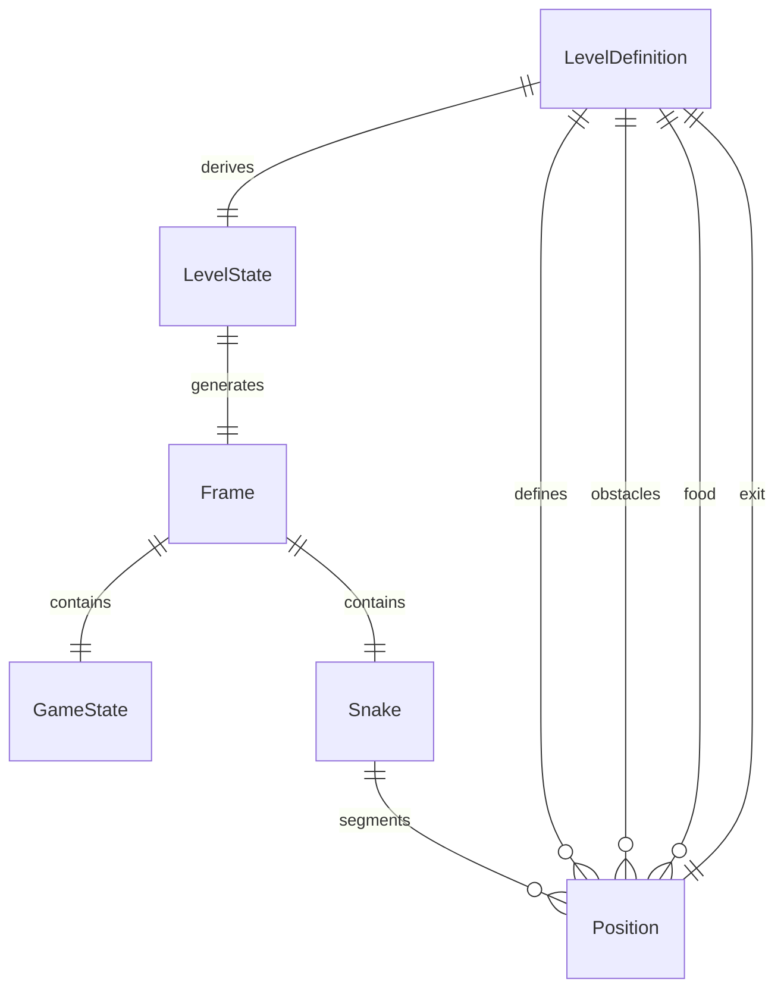
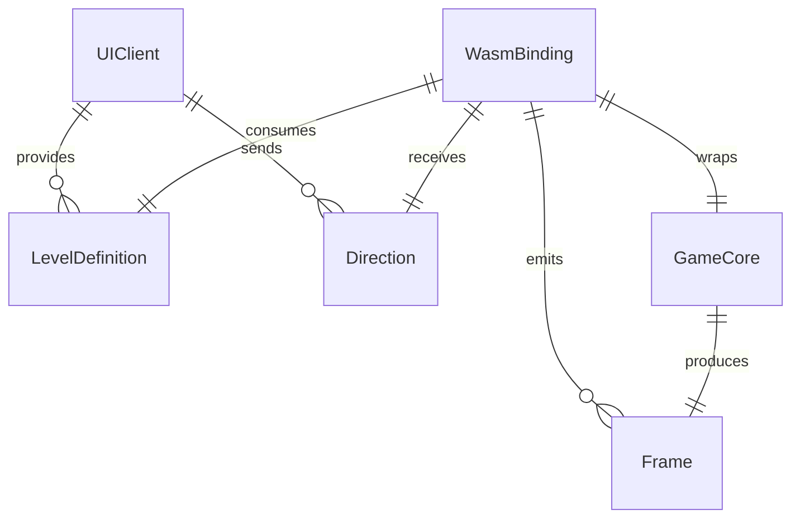

# Tech Plan: wasm-bindgen + ts-rs Integration

## Architectural Approach
- Split domain modeling from execution: `gsnake-core/engine/core` owns Rust domain logic and ts-rs derives; `gsnake-core/engine/bindings/wasm` remains a thin wasm-bindgen execution layer with JsValue in/out and minimal ABI-safe types.
- Authoritative rendering from Rust: UI consumes `Frame.grid` produced by core; Svelte stops recomputing grid and avoids desync between food/obstacles and runtime state.
- Shared type safety: ts-rs generates `gsnake-web/types/models.d.ts`, and TS imports these types directly; avoid hand-written duplicates for domain models, enums, and payloads.
- Runtime boundaries: wasm-bindgen exports only functions that start/advance/reset game and fetch frames; all serialized state uses serde (and thus ts-rs) to keep data-carrying enums consistent.
- Iteration velocity: keep wasm layer small to reduce JS glue changes; prefer direct serialization of domain structs to reduce manual mapping logic.
- Common demeanor (contract posture): stable shapes, explicit error states, and predictable event order; UI trusts the core as source of truth and never re-derives gameplay state.

## Data Model
- `LevelDefinition` (static): `id`, `name`, `grid_size`, `snake` (initial segments), `obstacles`, `food`, `exit`, `snake_direction`. Serialized via serde; ts-rs derives for TS usage.
- `LevelState` (runtime): mutable entities derived from `LevelDefinition` at load time: `snake`, `food`, `moves`, `status`, etc. Not exposed directly to UI; used by engine to compute `Frame`.
- `Frame` (authoritative render payload): `grid: Vec<Vec<CellType>>`, `state: GameState`, and `snake`. Serialized via serde; ts-rs derives.
- `GameState`: retains `status`, `current_level`, `moves`, `food_collected`, `total_food`; serialized for UI status, modals, and counters.
- `CellType` and `GameStatus` as data-carrying enums stay serde + ts-rs; wasm-bindgen only sees them inside serialized payloads (no C-like enums unless needed at runtime).

## Component Architecture
- Interface/Contract (UI <-> Core via wasm-bindgen):
  - Input: `LevelDefinition` JSON and `Direction` commands.
  - Output: `Frame` payloads; `GameState` is read from `Frame.state`.
  - Required order: init -> level load -> frame emission -> input loop; every accepted input yields a new `Frame`.
  - Error semantics: wasm init failures and schema mismatches surface as explicit errors; UI shows a failure state.
  - Source of truth: UI renders from `Frame.grid` only; derived or cached gameplay state in UI is advisory.
- Core (`gsnake-core/engine/core`):
  - `models.rs`: all domain structs/enums with serde + ts-rs derives.
  - `engine.rs`: pure logic, consumes `LevelDefinition`, produces `LevelState` and `Frame`.
- wasm wrapper (`gsnake-core/engine/bindings/wasm`):
  - `WasmGameEngine` exposes `new(level_json)`, `processMove(direction)`, `getFrame()`, `getLevels()`.
  - Uses JsValue serialization via `serde_wasm_bindgen`; no direct TS mapping.
- Web (`gsnake-web`):
  - `types/` imports generated `models.d.ts` from ts-rs.
  - `engine/WasmGameEngine.ts` only forwards payloads and dispatches events; no manual status/enum mapping.
  - `components/GameGrid.svelte` renders from `Frame.grid` and uses grid size dynamically from the frame.
- Tests:
  - Rust: unit tests for `engine.rs` and serialization of `LevelDefinition`, `Frame`, `GameState`.
  - Web: integration tests ensure `Frame.grid` drives UI correctly and that ts-rs types align with runtime payloads.

